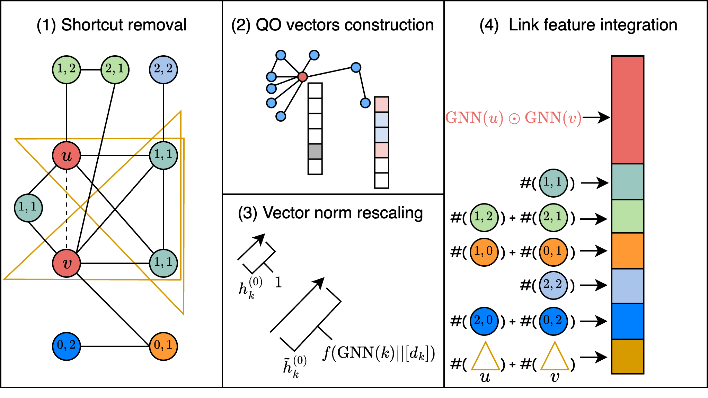

# Code for Message Passing Link Predictor (MPLP)
Neurips 2024 Paper: [Pure Message Passing Can Estimate Common Neighbor for Link Prediction](https://arxiv.org/abs/2309.00976)

Authors: Kaiwen Dong, Zhichun Guo, Nitesh V. Chawla



## Introduction
This repository contains the code for the paper [Pure Message Passing Can Estimate Common Neighbor for Link Prediction](https://arxiv.org/abs/2309.00976). MPLP is a simple yet effective message passing framework for link prediction. It is based on the observation that the common neighbor count can be estimated by performing message passing on the random vectors. MPLP is able to achieve state-of-the-art performance on a wide range of datasets on various domains, including social networks, biological networks, and citation networks. Moreover, MPLP is able to achieve new state-of-the-art performance on the [OGB leaderboard](https://ogb.stanford.edu/docs/leader_linkprop/) as of 2024-10-08:

|              | PPA        | Citation2   |
|--------------|------------|-------------|
| Metric       | Hits@100   | MRR         |
| Current SOTA | 63.22±1.74 | 90.18±0.15 |
| MPLP+        | 65.24±1.50 | 90.72±0.12 |


## Environment Setting
```
conda create -n mplp
conda install -n mplp pytorch torchvision torchaudio pytorch-cuda=11.8 pyg=2.3.0 pytorch-sparse=0.6.17 -c pytorch -c nvidia -c pyg
conda activate mplp
pip install ogb torch-hd
```

## Data Preparation
Part of the data has been included in the repository at `./data/`. For the rest of the data, it will be automatically downloaded by the code.

## Usage

To run experiments:
```
python main.py --dataset=physics --batch_size=2048 --use_degree=mlp --minimum_degree_onehot=60 --mask_target=True
```

In MPLP, there are couple of hyperparameters that can be tuned, including:

- `--dataset`: the name of the dataset to be used.
- `--predictor`: the predictor to be used. It can be `MPLP` or `MPLP+`.
- `--batch_size`: the batch size.
- `--signature_dim`: the node signature dimension `F` in MPLP.
- `--mask_target`: whether to mask the target node in the training set to remove the shortcut.
- `--use_degree`: the methods to rescale the norm of random vectors.
- `--minimum_degree_onehot`: the minimum degree of hubs with onehot encoding to reduce variance.


## Experiment Reproduction

<details>
<summary>Commands to reproduce the results of MPLP reported in the paper</summary>

### USAir
```
python main.py --dataset=USAir --xdp=0.8 --feat_dropout=0.05 --label_dropout=0.2 --use_embedding=True --batch_size=512 --weight_decay=0.001 --lr=0.0015 --encoder=puregcn
```
### NS
```
python main.py --dataset=NS --xdp=0.5 --feat_dropout=0.05 --label_dropout=0.2 --batch_size=512 --use_degree=mlp --lr=0.01
```
### PB
```
python main.py --dataset=PB --xdp=0.8 --feat_dropout=0.2 --label_dropout=0.6 --batch_size=512 --lr=0.0015 --batchnorm_affine=False
```
### Yeast
```
python main.py --dataset=Yeast --xdp=0.8 --feat_dropout=0.2 --label_dropout=0.2 --use_embedding=True --batch_size=512 --use_degree=RA --lr=0.0015 --encoder=puregcn --batchnorm_affine=False
```
### C.ele
```
python main.py --dataset=Celegans --xdp=0.8 --feat_dropout=0.6 --use_embedding=True --batch_size=512 --weight_decay=0.001 --use_degree=AA --lr=0.0015
```
### Power
```
python main.py --dataset=Power --xdp=0.8 --feat_dropout=0.2 --label_dropout=0.05 --use_embedding=True --batch_size=512 --weight_decay=0.001 --lr=0.0015 --encoder=puregcn
```
### Router
```
python main.py --dataset=Router --xdp=0.8 --feat_dropout=0.2 --label_dropout=0.05 --batch_size=512 --use_degree=mlp --encoder=puregcn
```
### E.coli
```
python main.py --dataset=Ecoli --xdp=0.8 --feat_dropout=0.05 --label_dropout=0.6 --use_embedding=True --batch_size=512 --use_degree=RA --batchnorm_affine=False
```
### CS
```
python main.py --dataset=cs --xdp=0.5 --feat_dropout=0.6 --label_dropout=0.05 --batch_size=4096 --use_degree=mlp --lr=0.01 --batchnorm_affine=False --patience=40
```
### Physics
```
python main.py --dataset=physics --xdp=0.1 --feat_dropout=0.2 --label_dropout=0.05 --batch_size=4096 --use_degree=mlp --encoder=puregcn --batchnorm_affine=False --patience=40
```
### Computers
```
python main.py --dataset=computers --xdp=0.1 --feat_dropout=0.2 --label_dropout=0.2 --batch_size=4096 --use_degree=mlp --minimum_degree_onehot=80 --use_embedding=True --patience=40
```
### Photo
```
python main.py --dataset=photos --xdp=0.5 --feat_dropout=0.05 --label_dropout=0.6 --batch_size=4096 --use_degree=mlp --minimum_degree_onehot=80 --lr=0.01 --use_embedding=True --batchnorm_affine=False --patience=40
```
### Collab
```
python main.py --dataset=ogbl-collab --use_embedding=True --batch_size=32768 --use_degree=mlp --patience=40 --log_steps=1 --year=2010 --use_valedges_as_input=True --xdp=0.8 --feat_dropout=0.6 --label_dropout=0.2
```

### Collab (no feat)
```
python main.py --dataset=ogbl-collab --use_feature=False --batch_size=8192 --mask_target=True --weight_decay=0 --use_degree=mlp --patience=40 --log_steps=1 --minimum_degree_onehot=50 --year=2010 --use_valedges_as_input=True --signature_dim=6000
```
[/logs/no_feat_ogbl-collab_jobID_769579_PID_606228_1690552809.log/]: #

### Vessel
```
python main.py --dataset=ogbl-vessel --batch_size=32768 --test_batch_size=32768 --predictor=MPLP --use_degree=RA --patience=20 --log_steps=1 --xdp=0.5 --feat_dropout=0.6 --label_dropout=0.05 --metric=AUC
```
</details>


<details>
<summary>Commands to reproduce the results of MPLP+ reported in the paper</summary>

### PPA
```
python main.py --dataset=ogbl-ppa --use_feature=False --batch_size=32768 --predictor=MPLP+ --use_degree=RA --patience=20 --log_steps=1 --xdp=0.5 --label_dropout=0.6 --use_embedding=True --metric=Hits@100 --runs=10 --test_batch_size=32768
```
### Citation2
```
python main.py --dataset=ogbl-citation2 --use_feature=False --batch_size=261424 --predictor=MPLP+ --use_degree=RA --patience=20 --log_steps=1 --xdp=0.8 --feat_dropout=0.05 --label_dropout=0.6 --encoder=puregcn --use_embedding=True --signature_dim=512 --minimum_degree_onehot=1500 --test_batch_size=3000000
```
### USAir
```
python main.py --dataset=USAir --xdp=0.8 --feat_dropout=0.05 --label_dropout=0.6 --use_embedding=True --batch_size=512 --weight_decay=0.001 --use_degree=RA --lr=0.0015 --encoder=puregcn --batchnorm_affine=False --predictor=MPLP+
```
### NS
```
python main.py --dataset=NS --xdp=0.5 --feat_dropout=0.05 --label_dropout=0.2 --batch_size=512 --weight_decay=0.001 --use_degree=mlp --encoder=puregcn --batchnorm_affine=False --predictor=MPLP+
```
### PB
```
python main.py --dataset=PB --xdp=0.8 --feat_dropout=0.2 --use_embedding=True --batch_size=512 --batchnorm_affine=False --predictor=MPLP+
```
### Yeast
```
python main.py --dataset=Yeast --xdp=0.8 --feat_dropout=0.05 --label_dropout=0.05 --use_embedding=True --batch_size=512 --use_degree=RA --encoder=puregcn --predictor=MPLP+
```
### C.ele
```
python main.py --dataset=Celegans --xdp=0.5 --feat_dropout=0.6 --use_embedding=True --batch_size=512 --use_degree=RA --lr=0.0015 --predictor=MPLP+
```
### Power
```
python main.py --dataset=Power --xdp=0.8 --label_dropout=0.2 --use_embedding=True --batch_size=512 --weight_decay=0.001 --lr=0.0015 --encoder=puregcn --predictor=MPLP+
```
### Router
```
python main.py --dataset=Router --xdp=0.8 --feat_dropout=0.05 --label_dropout=0.05 --batch_size=512 --use_degree=mlp --predictor=MPLP+
```
### E.coli
```
python main.py --dataset=Ecoli --xdp=0.8 --feat_dropout=0.05 --label_dropout=0.6 --use_embedding=True --batch_size=512 --batchnorm_affine=False --predictor=MPLP+
```
### CS
```
python main.py --dataset=cs --xdp=0.5 --feat_dropout=0.2 --label_dropout=0.2 --batch_size=4096 --predictor=MPLP+ --use_degree=mlp --minimum_degree_onehot=150 --encoder=puregcn --patience=40
```
### Physics
```
python main.py --dataset=physics --xdp=0.5 --feat_dropout=0.2 --label_dropout=0.2 --batch_size=4096 --predictor=MPLP+ --use_degree=mlp --encoder=puregcn --batchnorm_affine=False --patience=40
```
### Computers
```
python main.py --dataset=computers --xdp=0.8 --label_dropout=0.05 --batch_size=4096 --predictor=MPLP+ --use_degree=AA --minimum_degree_onehot=150 --use_embedding=True --patience=40
```
### Photo
```
python main.py --dataset=photos --xdp=0.8 --label_dropout=0.2 --batch_size=4096 --predictor=MPLP+ --use_degree=mlp --minimum_degree_onehot=150 --encoder=puregcn --use_embedding=True --batchnorm_affine=False --patience=40
```
### Collab
```
python main.py --dataset=ogbl-collab --use_embedding=True --batch_size=32768 --predictor=MPLP+ --use_degree=mlp --patience=40 --log_steps=1 --minimum_degree_onehot=100 --year=2010 --use_valedges_as_input=True --xdp=0.8 --feat_dropout=0.2 --label_dropout=0.2
```
### Vessel
```
python main.py --dataset=ogbl-vessel --use_feature=False --batch_size=32768 --test_batch_size=32768 --predictor=MPLP+ --patience=20 --log_steps=1 --xdp=0.5 --feat_dropout=0.2 --label_dropout=0.05 --metric=AUC
```

</details>

## Citation
If you find this repository useful in your research, please cite the following paper:
```
@article{dong2023pure,
  title={Pure Message Passing Can Estimate Common Neighbor for Link Prediction},
  author={Dong, Kaiwen and Guo, Zhichun and Chawla, Nitesh V},
  journal={arXiv preprint arXiv:2309.00976},
  year={2023}
}
```